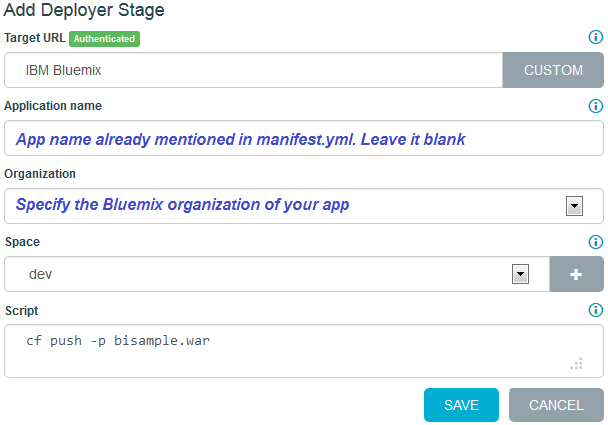

## Sample application

Sample application demonstrating how to develop a Big SQL client application using IBM Analytics for Hadoop cloud offering. 

The application loads a blog data into Hive and uses Big SQL JDBC connection to retrieve them.

You can play with an instance of the application running at http://samplemapreduce.mybluemix.net/

You can explore the code by clicking into the BigInsightsSample folder.

### Deploying the application from JazzHub to BlueMix

1) Fork this repository as a new project under your account

These samples have been updated recently. If you downloaded them previously, you might need
to delete your workspaces for the sample project and fork a new one before you can see the new
samples.

2) Update manifest.yml

Edit manifest.yml under BigInsightsSample folder to specify values for application name and host as shown below. Create an Analytics for Hadoop service instance in BlueMix and specify the service name under services section of the manifest.

Save the manifest file and commit the changes.

a) Click on the Git Repository action button

b) Provide a commit message and click the COMMIT button.

c) Click the PUSH button to push commits and tags from your local branch into the remote branch.

3) Configure Builder

Click BUILD & DEPLOY. Choose Advanced and you should see a screen like the one below.

Click add builder to configure a builder as shown below

Click REQUEST BUILD to initiate a build

4) Configure Deployer

Click the 'add a stage' icon and configure the deployer as shown below:

5) Drag and drop the build as shown below to deploy.

6) A step-by-step guide on how to work with the sample application is documented in this [developerWorks tutorial](http://www.ibm.com/developerworks/library/ba-hadoopanalytics-app/index.html)

### Licensed under the Apache License (see [License.txt](License.txt))